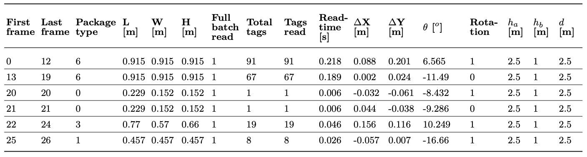

# Package Size Estimation Using UHF RFID Signature

This repository contains datasets representing a combination of reading scenarios for package size estimation using UHF RFID signature. The scenarios are categorized based on three key factors:

- **Type of Scenario (First Letter):**
  - (I) Ideal
  - (S) Simple
  - (C) Complex

- **Distance Between Antennas (Second Letter):**
  - (P) 2 m
  - (M) 2.5 m
  - (G) 3 m

- **Number of Boxes in the Tested Dataset (Third Letter):**
  - (P) 4 boxes
  - (M) 8 boxes
  - (G) 16 boxes

The files in TL1SXM, TL2SMF, and TL3NMM correspond to the data and results of the transfer learning approach.

## Data Explanation

The interrogation process utilizes Frequency Sweep Algorithm (FSA) with a fixed frame length of 16 slots. The experiment has been repeated 20,000 times, each with a random package configuration, to construct datasets for training the predictive system.

### Index File

The `index` file summarizes high-level statistics for the interrogation procedure of each package. Each row in the `index` file contains information such as the LxWxH dimensions of the box or its position with respect to the antennas.

Example of the data registered:

### Frames File

The `frames` file provides low-level statistics for each interrogation frame. It includes detailed statistics for each frame, as the interrogation procedure for each package typically comprises multiple frames.

Example of statistics collected:

(Note: The interrogation procedure for each package usually comprises multiple frames. For instance, the first package was inventoried in the first 12 frames, with the last tag identified in frame 12.)

These datasets have been utilized to train Artificial Neural Networks (ANNs) of different architectures. For detailed results, please refer to the paper:

**Title:** A Machine Learning Approach for Package Size Estimation Using UHF RFID Interrogation Signature

**Authors:** J. Vales-Alonso, P. López-Matencio

**Journal:** Applied Intelligence (APIN)

*Note: The paper is currently under the review process.*

Feel free to adapt and customize the content according to your preferences and additional details you may want to include.
